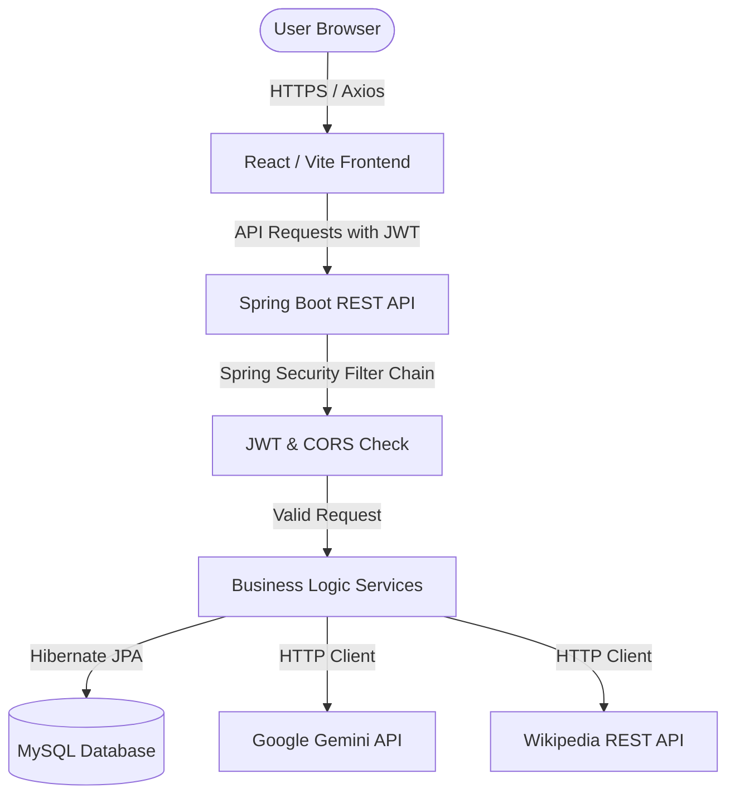

# 02. High-Level Architecture

## Overview
TripNest uses a classic decoupled **Client-Server Architecture**. The frontend React application compiles into static HTML/JS assets and runs in the user's browser, communicating with the Java Spring Boot backend over secure HTTP REST protocols. 

---

## Architectural Components

### 1. Presentation Layer (Frontend)
* **Technology**: React 19, Vite, Tailwind CSS.
* **Role**: Renders the UI, manages UI state (like active trip, editing state, local notifications), caches session tokens in local storage, and handles navigation.
* **API communication**: Initiated via Axios services. Token headers are injected on requests; authentication failures (401) are caught globally via response interceptors.

### 2. Security & Routing Layer (Backend Entrypoint)
* **CORS filter**: Permits HTTP requests from designated frontend origins (`http://localhost:5173`).
* **JWT Filter**: Intercepts requests, extracts the `Authorization: Bearer <token>` header, parses and validates the signature, and places the user identity into Spring's `SecurityContext`.
* **API Controller**: Maps URLs to handler methods. Validates incoming DTOs using `@Valid` annotation.

### 3. Business & Service Layer (Backend Core)
* **Spring Services**: Encapsulates business rules (e.g. calculating remaining budget, ordering itinerary days, sanitizing search queries).
* **MapStruct Mappers**: Converts raw JPA Database Entities into clean, serializable REST Response DTOs.
* **Third-Party Integrations**: Fetches recommendation outputs from Gemini and media details from Wikipedia.

### 4. Persistence Layer (Data)
* **Spring Data JPA**: Interacts with the database using repository abstractions.
* **Hibernate ORM**: Manages table mapping, foreign keys, transactions, and cascades.
* **MySQL Database**: Stores relational tables for Users, Trips, Destinations, Budgets, Expenses, Itineraries, and Activities.

---

## Core System Integration Points

### Authentication Flow
1. User registers/logs in -> Backend validates credentials and issues a signed JSON Web Token (JWT).
2. Frontend saves the JWT in `localStorage` (`token`).
3. For subsequent actions, the Axios interceptor reads this token and appends `Authorization: Bearer <token>`.
4. If a token expires, the backend returns `401 Unauthorized`. The frontend Axios interceptor clears `localStorage` and routes the user back to the login screen.

### Destination Search Flow
1. User searches for a state -> Request hits `GET /api/destinations?state={state}`.
2. Backend queries the Gemini API. If the API is unreachable (network/DNS/timeout), it falls back to generating a list of mock destinations locally.
3. For each destination in the list, the backend queries the Wikipedia API to retrieve coordinate data, text extracts, and page URLs.
4. Results are compiled, merged, and returned as a list of `DestinationResponse` DTOs.

---

## Why These Technologies Were Chosen

| Component | Choice | Reason |
| :--- | :--- | :--- |
| **Vite** | Build Tool | Provides instant Hot Module Replacement (HMR) during frontend development, compiling large React bundles in milliseconds compared to older Webpack configurations. |
| **React Context** | State | Simple, built-in global state management for small-to-medium apps, avoiding the heavy boilerplate of Redux. |
| **Spring Boot** | Backend | Enterprise standard for building Java services. Simplifies configuration, dependency management, and servlet hosting. |
| **Spring Security** | Security | Declarative filter chain model that makes securing specific routes and endpoints robust. |
| **MapStruct** | Mapping | Generates mapping code at compile-time using regular method calls. Much faster than reflection-based mappers (like ModelMapper) and catches field mismatches during build. |
| **MySQL** | Database | Relational database supporting acid compliance, transactions, and cascades required to keep nested objects (Trip -> Itinerary -> Activities) in sync. |
