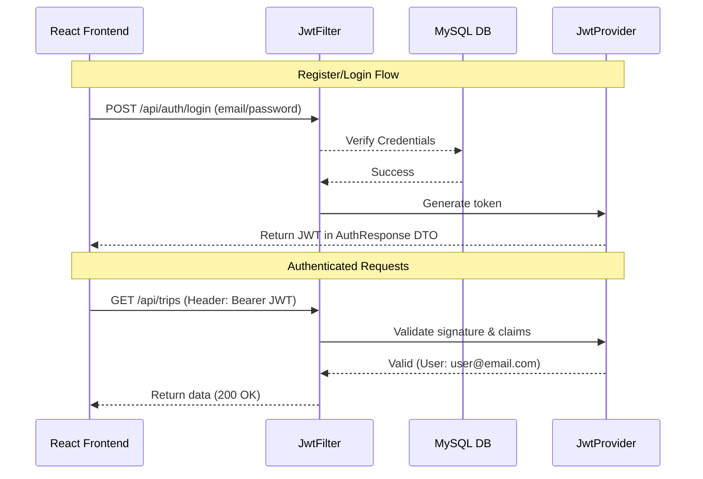

# 05. Authentication & Security

## Overview
TripNest uses **stateless JWT (JSON Web Token) authentication** to secure its REST endpoints. Sessions are not stored on the server; instead, the frontend stores the token in local storage and includes it in the header of every authenticated HTTP request.

---

## Authentication Workflow

### 1. Registration
1. Frontend compiles user details and submits them to `POST /api/auth/register`.
2. Backend intercepts the request in `AuthController`.
3. `UserServiceImpl` checks if a user with that email already exists.
4. If unique, the raw password is encrypted using a `PasswordEncoder` bean, mapped via `UserMapper`, and saved to the MySQL `users` table.
5. A JWT is generated for this user.
6. The backend returns a success response with the JWT and user profile.

### 2. Login
1. Frontend submits credentials to `POST /api/auth/login`.
2. Backend validates the password against the stored BCrypt hash.
3. If they match, a signed JWT containing the user's email is generated.
4. The JWT is returned inside an `AuthResponse` DTO.



---

## Security Configuration (`SecurityConfig.java`)
The backend secures routes by defining a filter chain.
* **Public Routes**:
  * `/api/auth/**` (Registration, Login)
  * Swagger endpoints (`/v3/api-docs/**`, `/swagger-ui/**`, `/swagger-ui.html`)
  * Preflight CORS requests (`OPTIONS` requests) are permitted universally.
* **Secured Routes**: All other paths under `/api/**` require a valid JWT.

---

## JWT Filter Chain (`JwtAuthenticationFilter.java`)
Every request to a secured route passes through this filter before reaching the Controllers:
1. **Extraction**: Reads the `Authorization` header. Extracts the substring after `"Bearer "`.
2. **Parsing**: Calls `JwtTokenProvider` to extract the username (email) and verify the signature.
3. **Context Binding**: If valid, it loads the user details, creates a Spring `UsernamePasswordAuthenticationToken` object, and binds it to Spring's `SecurityContextHolder`.

---

## Session Expiration & Response Interceptor
* **JWT Expiry**: Tokens are configured to expire after a set time (e.g., 24 hours).
* **Token Invalidation (401)**: If a request is made with an expired or malformed token, the backend rejects it with `401 Unauthorized`.
* **Axios Interceptor**: The frontend's `api.js` interceptor catches 401s globally:
```javascript
API.interceptors.response.use(
  response => response,
  error => {
    if (error.response && error.response.status === 401) {
      removeToken(); // Clear expired token
      window.location.href = "/"; // Redirect to login
    }
    return Promise.reject(error);
  }
);
```

---

## Data Transfer Objects (DTOs)

### `RegisterRequest`
```json
{
  "name": "Jane Doe",
  "email": "jane@example.com",
  "password": "Password123"
}
```

### `LoginRequest`
```json
{
  "email": "jane@example.com",
  "password": "Password123"
}
```

### `AuthResponse`
```json
{
  "token": "eyJhbGciOiJIUzI1NiJ9.eyJzdWIiOiJqYW5lQGV4YW1wbGUuY29tIiwiaWF0IjoxNzM...",
  "user": {
    "email": "jane@example.com",
    "name": "Jane Doe"
  }
}
```
