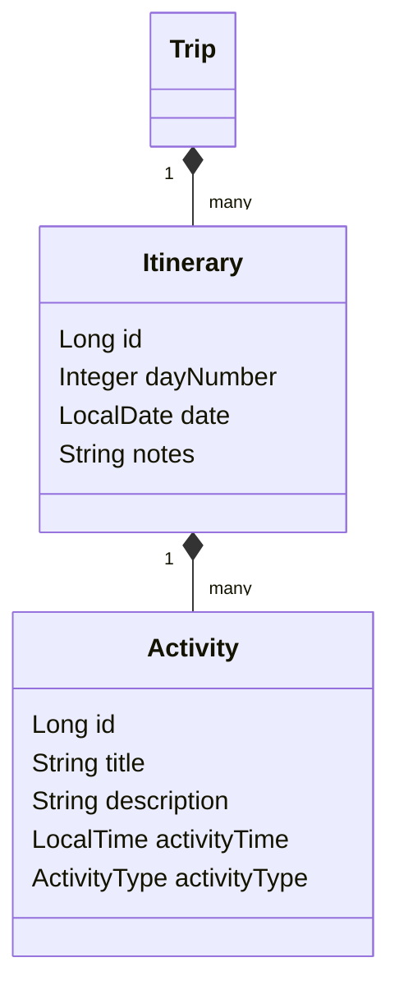

# 07. Itinerary Planner Module

## Overview
The **Itinerary Planner** coordinates day-by-day activities for a trip. Days are generated automatically when a trip is created based on its date range, and users can add, edit, or remove specific activities on any given day.

---

## Technical Architecture



### 1. Daily Itinerary (`Itinerary.java`)
* **`id`**: Primary Key.
* **`dayNumber`**: Sequential index (e.g. Day 1, Day 2).
* **`date`**: Specific LocalDate matching the day.
* **`notes`**: Daily descriptions or summaries.
* **`activities`**: `@OneToMany` ordered collection of planned events.

### 2. Daily Activities (`Activity.java`)
* **`id`**: Primary Key.
* **`title`**: Name of the activity.
* **`description`**: Custom text notes.
* **`activityTime`**: LocalTime (e.g. `09:00:00`) defining when it takes place.
* **`activityType`**: Enum containing categorized types (`SIGHTSEEING`, `TRANSPORT`, `MEAL`, `ACCOMMODATION`, `OTHER`).

---

## API Lifecycle Operations

### 1. Create Activity (`POST /api/trips/{tripId}/days/{dayNumber}/activities`)
* **Request Payload**:
```json
{
  "title": "Visit Charminar",
  "description": "Historical monument built in 1591.",
  "activityTime": "09:30:00",
  "activityType": "SIGHTSEEING"
}
```
* **Backend Processing**:
  1. Locates the user's trip by ID.
  2. Resolves the specific `Itinerary` corresponding to `dayNumber`.
  3. Instantiates a new `Activity` entity, links it to the `Itinerary`, and saves it.
* **Response DTO**: `ActivityResponse`.

### 2. Update Activity (`PUT /api/trips/activities/{activityId}`)
* **Request Payload**: Modified title, description, time, or type.
* **Backend Processing**: Locates the activity by ID, updates its attributes, and saves it.

### 3. Delete Activity (`DELETE /api/trips/activities/{activityId}`)
* **Backend Processing**: Removes the activity from the database.

---

## Frontend Integration (`Planner.jsx`)

### Time Formatter Helper
Vite packages the time in ISO string formats. The frontend formats `LocalTime` using custom utility methods:
```javascript
  const formatTimeForForm = (timeStr) => {
    if (!timeStr) return "09:00 AM";
    const parts = timeStr.split(":");
    if (parts.length < 2) return "09:00 AM";
    let hours = parseInt(parts[0], 10);
    const minutes = parts[1];
    const ampm = hours >= 12 ? 'PM' : 'AM';
    hours = hours % 12;
    hours = hours ? hours : 12; // the hour '0' should be '12'
    return `${hours.toString().padStart(2, '0')}:${minutes} ${ampm}`;
  };
```

### Activity Management
* When a user loads `Planner.jsx`, it renders the days in a timeline list.
* Adding a new card triggers `createActivity` from `activityService.js` and reloads the trip state:
```javascript
  const handleAddActivity = async (e) => {
    e.preventDefault();
    try {
      const payload = {
        title: activityForm.title,
        description: activityForm.description,
        activityTime: activityForm.time + ":00", // Format to HH:mm:ss
        activityType: activityForm.type
      };
      await createActivityApi(activeTripId, selectedDay, payload);
      await loadTrips(); // Refresh local Context State
    } catch (err) {
      console.error(err);
    }
  };
```
