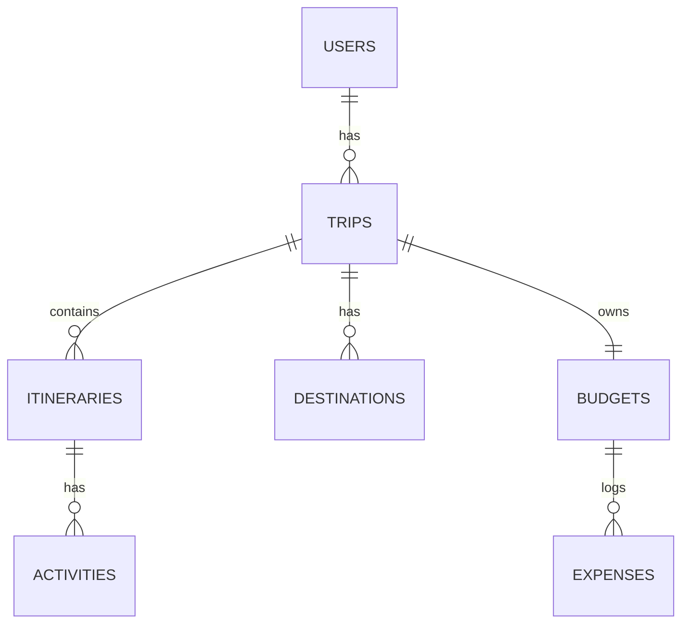

# 10. Database Schema & Entities

## Entity-Relationship Diagram

---

## Schema & Tables

### 1. `users`
Stores user profile information.
* **Columns**:
  * `id` (BIGINT, PK): Auto-incremented identifier.
  * `name` (VARCHAR): User's name.
  * `email` (VARCHAR, UNIQUE): Login identifier.
  * `password` (VARCHAR): Encrypted BCrypt password hash.
  * `phone`, `country`, `bio`, `photo`, `travel_style`, `emergency_contact`, `notifications` (VARCHAR): Optional profile metadata.

### 2. `trips`
Tracks trip metadata.
* **Columns**:
  * `id` (BIGINT, PK): Auto-incremented identifier.
  * `trip_name` (VARCHAR): Custom name for the trip.
  * `start_date`, `end_date` (DATE): Travel window.
  * `status` (VARCHAR): Enum string (`UPCOMING`, `ACTIVE`, `COMPLETED`).
  * `notes`, `description` (TEXT): Custom notes.
  * `total_members` (INT): Number of travelers.
  * `cover_image` (VARCHAR): Optional image URL.
  * `user_id` (BIGINT, FK): Links to `users.id`.
* **Cascade Behavior**: Deleting a trip cascades and deletes its associated destinations, itineraries, budgets, and expenses (`cascade = CascadeType.ALL, orphanRemoval = true`).

### 3. `destinations`
Stores locations added to a trip.
* **Columns**:
  * `id` (BIGINT, PK): Auto-incremented identifier.
  * `name` (VARCHAR): Name of the destination.
  * `city`, `state`, `country` (VARCHAR): Address details.
  * `trip_id` (BIGINT, FK): Links to `trips.id`.

### 4. `itineraries`
Tracks the individual days of a trip.
* **Columns**:
  * `id` (BIGINT, PK): Auto-incremented identifier.
  * `day_number` (INT): Sequential day index (e.g. 1, 2, 3).
  * `date` (DATE): Calendar date for the day.
  * `notes` (TEXT): Daily description.
  * `trip_id` (BIGINT, FK): Links to `trips.id`.

### 5. `activities`
Tracks planned events for a specific day.
* **Columns**:
  * `id` (BIGINT, PK): Auto-incremented identifier.
  * `title` (VARCHAR): Name of the activity.
  * `description` (TEXT): Custom notes.
  * `activity_time` (TIME): Specific time of day.
  * `activity_type` (VARCHAR): Enum category (`SIGHTSEEING`, `TRANSPORT`, `MEAL`, `ACCOMMODATION`, `OTHER`).
  * `itinerary_id` (BIGINT, FK): Links to `itineraries.id`.

### 6. `budgets`
Tracks trip financing.
* **Columns**:
  * `id` (BIGINT, PK): Auto-incremented identifier.
  * `total_budget` (DECIMAL): Total budget limit.
  * `total_spent` (DECIMAL): Sum of all logged expenses.
  * `remaining_budget` (DECIMAL): Calculated balance (`total_budget - total_spent`).
  * `trip_id` (BIGINT, FK): Links to `trips.id`.

### 7. `expenses`
Logs individual expenses.
* **Columns**:
  * `id` (BIGINT, PK): Auto-incremented identifier.
  * `amount` (DECIMAL): Cost.
  * `category` (VARCHAR): Enum category (`TRANSPORTATION`, `HOTEL`, `FOOD`, `ACTIVITIES`, `OTHER`).
  * `description` (VARCHAR): Description of the expense.
  * `expense_date` (DATE): Date of the expense.
  * `budget_id` (BIGINT, FK): Links to `budgets.id`.
