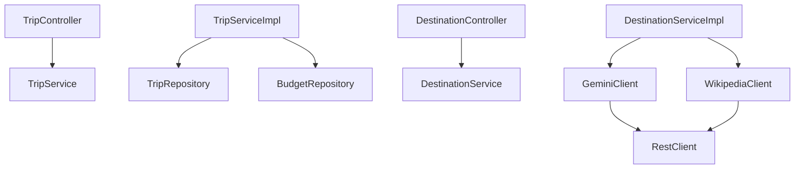

# 13. System Class Diagrams

This section illustrates class dependencies and data layouts inside the TripNest backend codebase.

---

## Entity Relationships
The following diagram highlights relationships, primary/foreign keys, and data properties in the model layer:

```mermaid
classDiagram
    class User {
        Long id
        String name
        String email
        String password
        List~Trip~ trips
    }
    class Trip {
        Long id
        String tripName
        LocalDate startDate
        LocalDate endDate
        TripStatus status
        String notes
        User user
        List~Itinerary~ itineraries
        List~Destination~ destinations
        Budget budget
    }
    class Destination {
        Long id
        String name
        String city
        String state
        String country
        Trip trip
    }
    class Itinerary {
        Long id
        Integer dayNumber
        LocalDate date
        String notes
        Trip trip
        List~Activity~ activities
    }
    class Activity {
        Long id
        String title
        String description
        LocalTime activityTime
        ActivityType activityType
        Itinerary itinerary
    }
    class Budget {
        Long id
        BigDecimal totalBudget
        BigDecimal totalSpent
        BigDecimal remainingBudget
        Trip trip
        List~Expense~ expenses
    }
    class Expense {
        Long id
        BigDecimal amount
        ExpenseCategory category
        String description
        LocalDate expenseDate
        Budget budget
    }

    User "1" --* "many" Trip
    Trip "1" --* "many" Itinerary
    Trip "1" --* "many" Destination
    Trip "1" --| "1" Budget
    Itinerary "1" --* "many" Activity
    Budget "1" --* "many" Expense
```

---

## Service & Client Associations
This diagram outlines how REST controllers interact with core business services and external HTTP clients:


