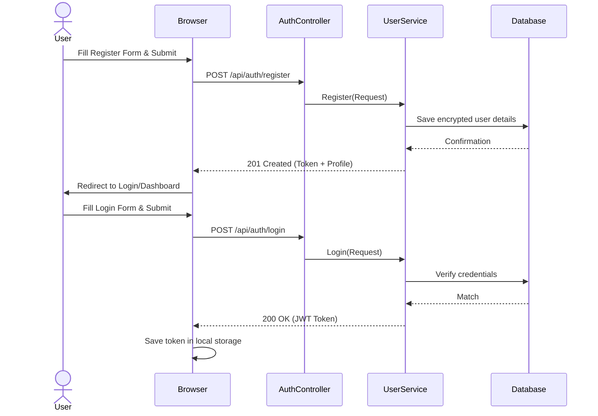
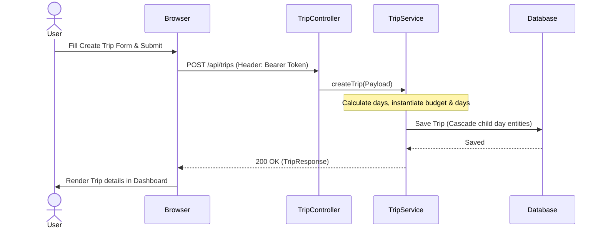
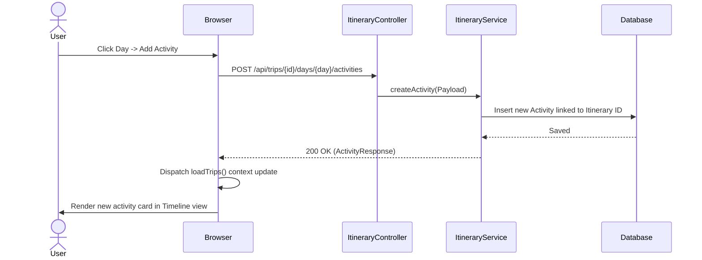

# 18. Project Workflow Diagrams

This section outlines user workflows through visual UML sequence flows.

---

## 1. Register & Login Workflow

---

## 2. Trip CRUD & Scheduling Workflow

---

## 3. Itinerary & Activity Planning Workflow

